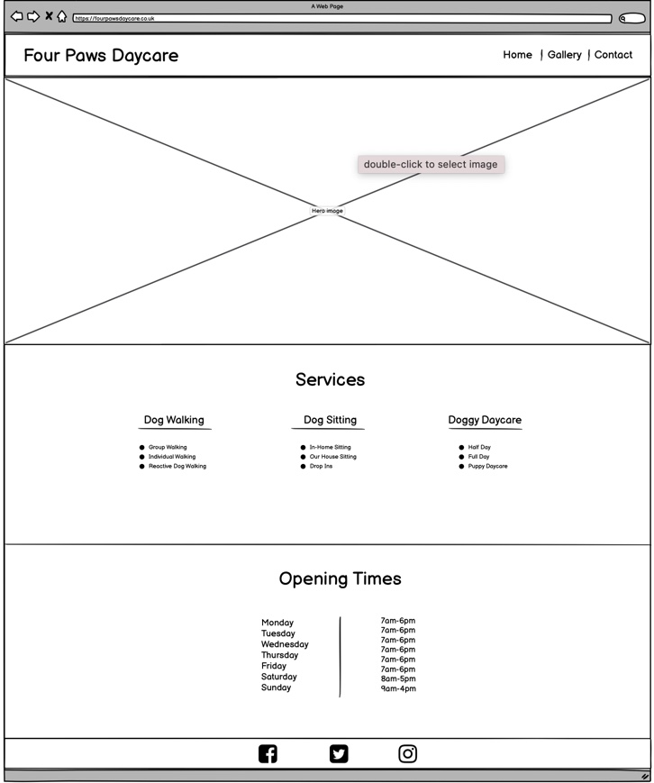

# Four Paws

Four Paws is a site advertising the dog care services of a small business in Surrey, England. This site will be targeted towards dog owners who are seeking professional dog walking, sitting and day care services in their local area. The site will clearly show the available services, opening times and an image gallery showing the facilities and type of dogs the business currently care for.  

## User Experience (UX)

### User stories

* First Time Visitor Goals
  * As a First Time Visitor, I want to easily understand the main purpose of the site and learn more about what services are available.
  * As a First Time Visitor, I want to be able to easily navigate throughout the site to find content.
  * As a First Time Visitor, I want to look for opening times so I know if the service will be able to meet my schedule.

* Returning Visitor Goals
  * As a Returning Visitor, I want to find information about opening times.
  * As a Returning Visitor, I want to find the best way to get in contact with the organisation with any questions I may have.
  * As a Returning Visitor, I want to find community links.

* Frequent User Goals
  * As a Frequent User, I want to check to see if there are any newly added photos.
  * As a Frequent User, I want to check to see if there are any new services.
  * As a Frequent User, I want to check if there are changed to the opening times during holidays etc.

### Design

* Colour Scheme
  * The two main colours used are light dusty pink and medium grey. With accents of dark dusty pink.

* Typography
  * The Baloo 2 font is the main font used throughout the whole website with Sans Serif as the fallback font in case for any reason the font isn't being imported into the site correctly. Baloo 2 is a fun font that is clear and easy to read.

* Imagery
  * Imagery is important. The large, hero image is designed to be bold and catch the user's attention. It also has an energetic and fun feeling.
  * The images in the gallery are fun, in-sync with each other and informative.

### Wireframes

    * Home Page Wireframe - 

    * Gallery Wireframe - [View]()

    * Contact Us Page Wireframe - [View]()

## Features

### Existing Features

* Navigation Bar
  * Featured on all three pages, the fully responsive navigation bar includes links to the Logo, Home page, Gallery and Contact page and is identical in each page to allow for easy navigation and satisfying UX.
  * This section will allow the user to easily navigate from page to page across all devices without having to revert back to the previous page via the ‘back’ button.

* The landing page image
  * The landing includes a bright and welcoming image of a dog playing with a ball in the local woods.
  * This section introduces the user to Four Paws Daycare with an interesting animation to grab their attention

* Services Section
  * The services section will show the user the exact services Four Paws Daycare provides.
  * This will allow the user to quickly see the content they are seeking upon visiting the site, so they know whether it is worth enquiring further.

* Opening Times Section
  * This section will clearly display the different opening times for each day of the week in an easy to read layout.
  * This will allow the user to quickly ascertain whether the service times available match up with their expectations, along with knowing when the business is open and available to take enquiries.

* The Footer
  * The footer section includes links to the relevant social media sites for Four Paws Daycare. The links will open to a new tab to allow easy navigation for the user.
  * The footer is valuable to the user as it encourages them to keep connected via social media and allows the user to view further photographs and reviews on these platforms.

* Gallery
  * The gallery will provide the user with supporting images to see how happy the dogs are under Four Paws Daycare's care.
  * This section is valuable to the user as they will be able to see how much space is available for their dog along with the multiple types of dogs that the business have experience with to help reassure them further.

* The Contact Page
  * This page will allow the user to see the address, telephone number and email address for the business.
  * It will include a google maps link so that the user can clearly identify the distance needed to travel to use their daycare services.
  * It will also include an enquiry form so that the user can submit a further enquiry if they would like to know more information.

### Features Left to Implement

* About Us page
  * A further feature to add would be a page with images of each individual team member, with a brief description of themselves and why they love caring for dogs.
  * This page would also include an insert from the owners explaining more about why they decided to start Four Paws Daycare.

* Price List
  * Another valuable feature to add would be a price list for the services, so that the user can identify immediately whether the service price meet their expectations and budget.

## Technologies Used

### Languages Used

* HTML5
* CSS3

## Frameworks, Libraries & Programs Used

* Bootstrap 5:
  * Bootstrap was used to assist with the responsiveness and styling of the website.
* Google Fonts:
  * Google fonts were used to import the "Baloo 2" font via link on the index.html page.
* Font Awesome:
  * Font Awesome was used on all pages throughout the website to add icons for aesthetic and UX purposes.
* jQuery:
  * jQuery came with Bootstrap to make the navbar responsive.
* Git
  * Git was used for version control by utilizing the Gitpod terminal to commit to Git and Push to GitHub.
* GitHub:
  * GitHub is used to store the projects code after being pushed from Git.
* Balsamiq:
  * Balsamiq was used to create the wireframes during the design process.

## Validator Testing

The W3C Markup Validator and W3C CSS Validator Services were used to validate every page of the project to ensure there were no syntax errors in the project.

    * W3C Markup Validator - [Results](http://jigsaw.w3.org/css-validator/validator$link)
    * W3C CSS Validator - [Results](https://validator.w3.org/nu/#textarea)

## Testing User Stories from User Experience (UX) Section

* First Time Visitor Goals
  * As a First Time Visitor, I want to easily understand the main purpose of the site and learn more about the organisation.
    * Upon entering the site, users are automatically greeted with a clean and easily readable navigation bar to go to the page of their choice. Underneath there is a Hero Image with a large services heading which shows the purpose of the site.
    * The main points are made immediately with the services section.
    * The user has two options, click the contact us page and make direct contact, or make and enquiry using the form.

  * As a First Time Visitor, I want to be able to easily be able to navigate throughout the site to find content.
    * The site has been designed to be fluid and never to entrap the user. At the top of each page there is a clean navigation bar, each link describes what the page they will end up at clearly.
    * On the Contact Us Page, after a form response is submitted, the page refreshes and the user is brought to the top of the page where the navigation bar is.

  * As a First Time Visitor, I want to look for opening times so I know if the service will be able to meet my schedule.
    * Once the new visitor has scrolled past the image they will immediately be provided with the opening times section.

* Returning Visitor Goals
  * As a Returning Visitor, I want to find information about opening times.
    * These are clearly shown on the homepage.

  * As a Returning Visitor, I want to find the best way to get in contact with the organisation with any questions I may have.
    * The navigation bar clearly highlights the "Contact Us" Page.
    * Here they can fill out the form on the page to be contacted, or they can use the Daycare contact details.
    * The footer contains links to the organisations Facebook, Twitter and Instagram page.
    * Whichever link they click, it will be open up in a new tab to ensure the user can easily get back to the website.

  * As a Returning Visitor, I want to find community links.
    * The Facebook Page can be found at the footer of every page and will open a new tab for the user and more information can be found on the Facebook page.

* Frequent User Goals
  * As a Frequent User, I want to check to see if there are any newly added photos.
    * The user would already be comfortable with the website layout and can easily access the photos pages.
    * As a Frequent User, I want to check to see if there are any new services.
            The user would already be comfortable with the website layout and can easily see if any new services have been added.
    * As a Frequent User, I want to check if there are changed to the opening times during holidays etc.
            The homepage provided the opening times so the user would quickly be able to check if there have been any changes.

## Further Testing

* The Website was tested on Google Chrome, Internet Explorer, Firefox and Safari browsers.
* The website was viewed on a variety of devices such as Desktop, Laptop, iPhone 11 & iPhone 11pro.
* A large amount of testing was done to ensure that all pages were linking correctly.

## Known Bugs

  * When sized down to a mobile view, the bootstrap gallery sections into 2 photos per column which give an appearance of uneven white spacing between the photos.

## Deployment

## Credits

### Code

* The Hero Image animation came from Code Institute, Love Running Project.

* Bootstrap5: Bootstrap Library used throughout the project mainly to make site responsive using the Bootstrap Grid System.

### Content

* All content was written by the developer.

### Media

* All Images were sourced from Pexels
  * "Dog-1" - Snapwire
  * "Dog-2" - Valeria Boltneva
  * "Dog-3" - Jayden Burdick
  * "Dog-4" - Adam Kontor
  * "Dog-5" - Vlad Chețan
  * "Dog-6" - Dariusz Grosa
  * "dog-iphone" - Mithul Varshan
  * "dog-with-ball" - Chepté Cormani
